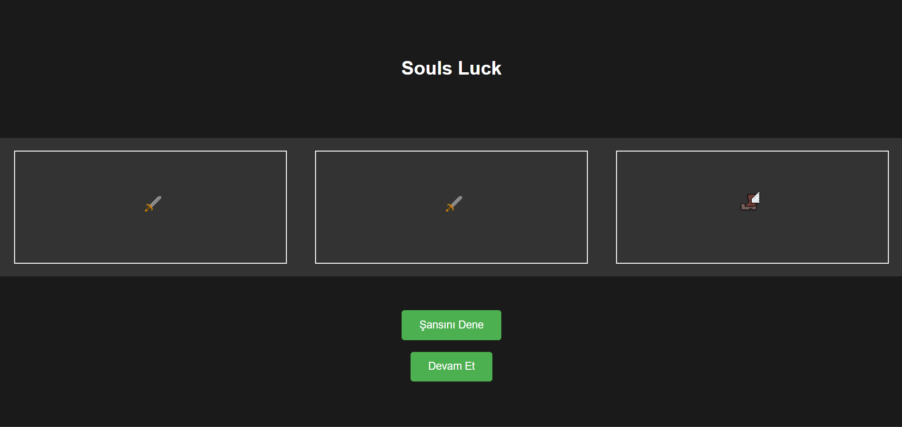
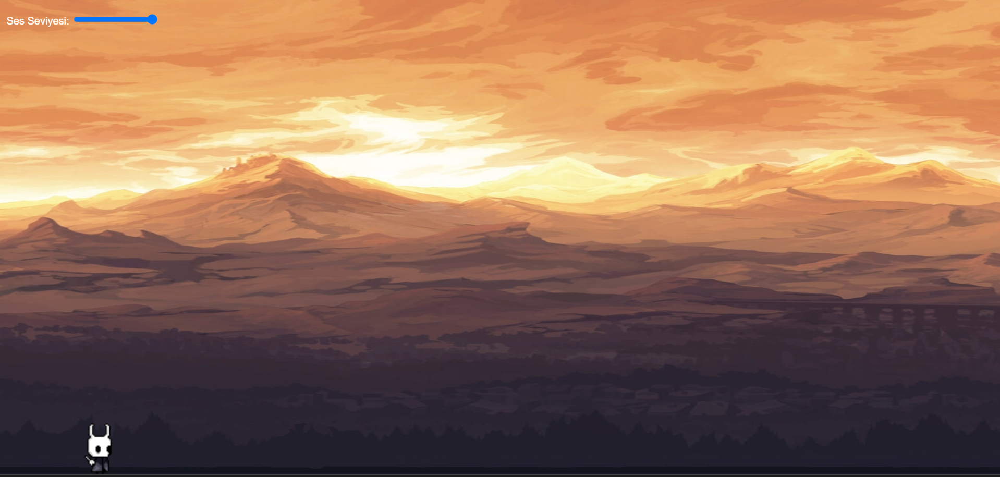
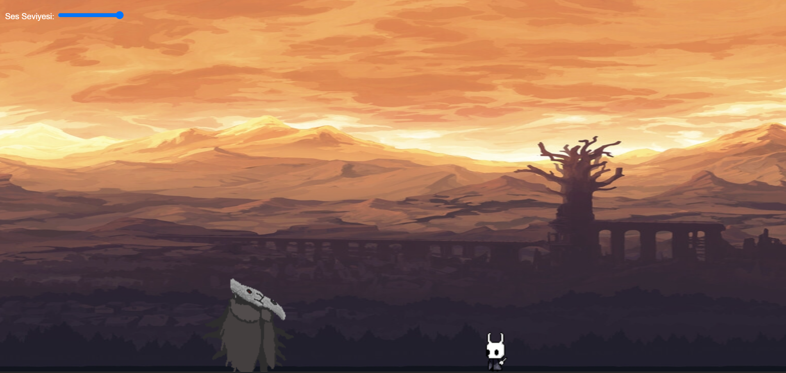

# Souls Luck

**Strange Luck**, oyunun bazı temek mekanikleri alınıp tasarlanmış bir oyundur.

**Souls Luck**, başta rastgele olarak verilen boost özelliklerini kullanarak oyundaki yaratığı öldürmeye çalıştığın bir oyundur.

oyuna buradan erişebilirsiniz.
```
RetcapS.github.io
```
## İçindekiler
- [Oyun Hakkında](#oyun-hakkında)
- [Oynanış Mekanikleri](#oynanış-mekanikleri)
- [Ekran Görüntüleri](#ekran-görüntüleri)
- [Assetler](#Assetler)
- [Kaynakça](#kaynakça)

## Oyun Hakkında
**Souls Luck**, oyuncuların bir karakteri yönlendirerek oyunun başında rastgele verilmiş güçlendirmeler ile oyun içindeki bossu öldürmeye çalıştığı 2D bir oyundur.

## Oynanış Mekanikleri
Oyunda kullanılan temel mekanikler şunlardır:

- **Hareketler**:
  - Ok tuşları veya `A` ve `D` tuşlarıyla karakteri sağa ve sola hareket ettirebilirsiniz.
  - `W` tuşu ile zıplayabilirsiniz.

- **Kontroller**:
  -Şarkının sesini ayarlayabileceğimiz bir çubuk içeriyor.


## Ekran Görüntüleri






###  Assetler
Oyun içindeki karakterler , arkaplan ve bunların animasyonları kendim tarafından tasarlanmıştır.
Müzik dış bir kaynaktan alınmıştır. (https://www.youtube.com/watch?v=OaXMG4OzGOo)

## Kaynakça
Nasıl yapabileceğime dair bir fikrim olması için izlediğim youtube videoları
```
https://www.youtube.com/watch?v=rTVoyWu8r6g&t=6765s
https://www.youtube.com/watch?v=vyqbNFMDRGQ&t=1207s
```
-ChatGPT
-Grok
-Tasarımları ve animasyonları yaparken kullandığım uygulama
```
https://www.aseprite.org/
```

